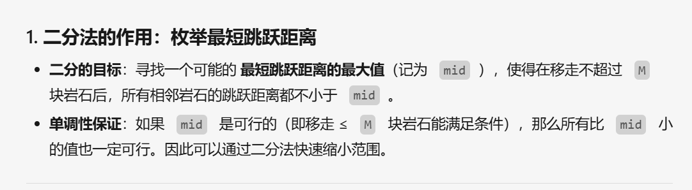
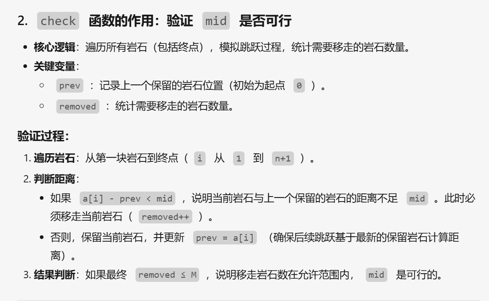
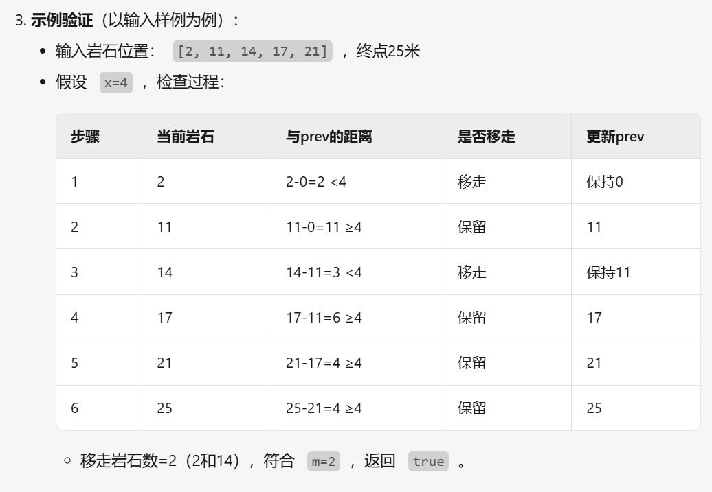
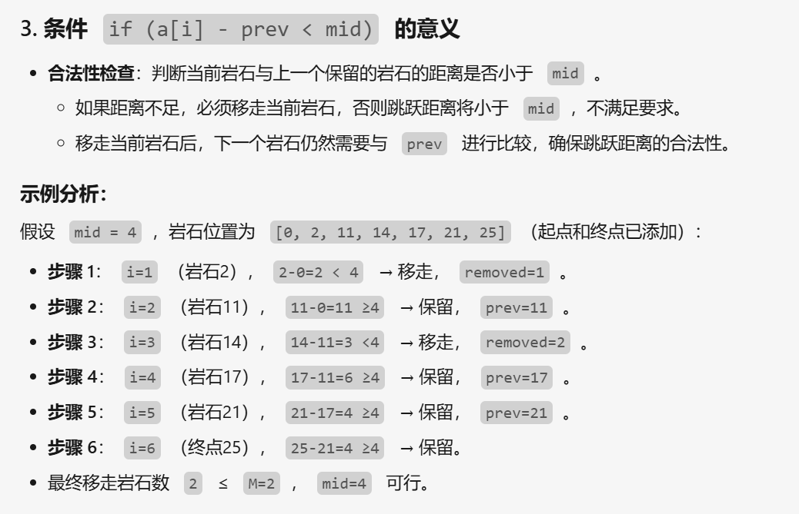
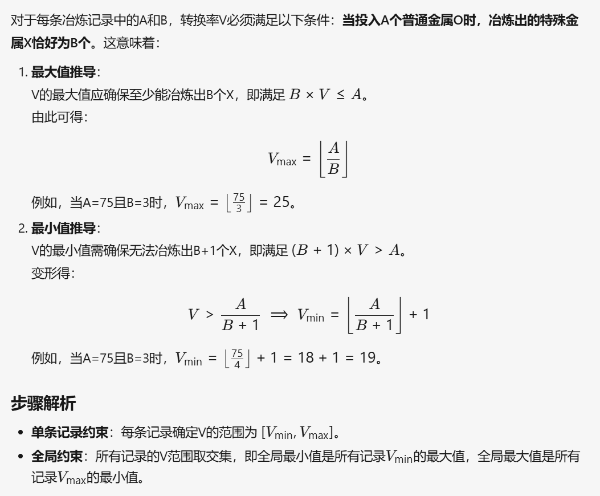
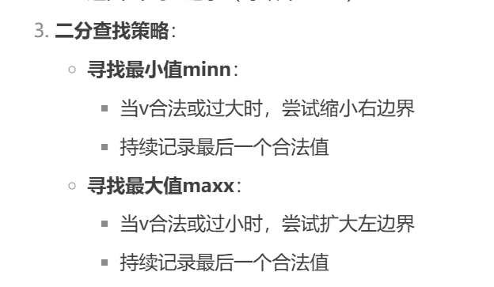
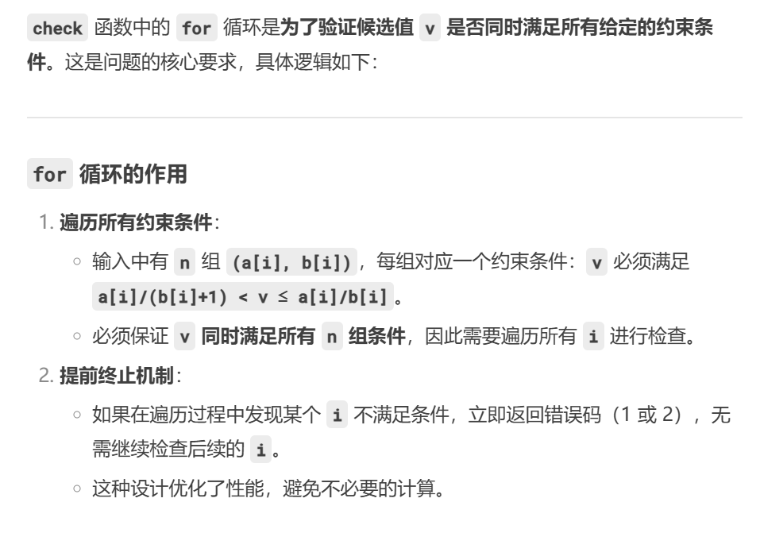

**二分的常见题面：使得选手们在比赛过程中的最短跳跃距离尽可能长。如果题目规定了有“最大值最小”或者“最小值最大”的东西，那么这个东西应该就满足二分答案的有界性（显然）和单调性（能看出来）。**

## [P2678 [NOIP 2015 提高组] 跳石头 - 洛谷](https://www.luogu.com.cn/problem/P2678)
其实这道题跟传统的二分区别倒是不大,但是需要理解枚举的东西，比如这道题就是枚举的两个岩石之间的距离,通过二分来猜，然后输出可行性的答案,下面给出ai的模拟过程 
		
		
		
		
		以下涉及[快读](../模板/快读.md)
		
```cpp 
	/*check()函数检查当前mid是否符合要求
	判断是否能在移走 ≤ `m` 块岩石的前提下，使得所有跳跃距离 ≥ mid*/
	bool check(int mid) {  
    int tot = 0; //可移走的石头数量  
    int i = 0; //第几块石头  
    int now = 0; //当前石头的位置  
    while (i < n + 1){  
        i++;  
        if (a[i] - a[now] < mid) //当前石头与前一个保留的岩石距离太短，移除  
            tot++;  
        else now = i;  
    }  
    return tot <= m;  
}
  /*二分部分代码*/
  signed main() {  
    ios::sync_with_stdio(false);  
    cin.tie(nullptr), cout.tie(nullptr);  
    d = read(), n = read(), m = read();  //read()为快读模版;
    for (int i = 1; i <= n; ++i) a[i] = read();  
  
    a[n + 1] = d;  
    l = 1, r = d;  
    while (l <= r){  
        mid = l + (r - l >> 1); //两岩石之间的距离  
        if (check(mid)){ //满足条件的mid，尝试更大的mid  
            ans = mid;  
            l = mid + 1;  
        } else //两石头间的距离过大，尝试更小的值  
            r = mid - 1;  
    }  
  
    cout << ans << endl;
```


# [P9240 [蓝桥杯 2023 省 B] 冶炼金属 - 洛谷](https://www.luogu.com.cn/problem/P9240)
[P9240 [蓝桥杯 2023 省 B] 冶炼金属 - 洛谷](https://www.luogu.com.cn/problem/P9240)
## 这道题有两种做法，一种是纯数学推导，一种是二分猜答案
下面是数学推导的过程:
		
```cpp
	int maxx = INT_MAX, minn = 0;  
	  
signed main() {  
    ios::sync_with_stdio(false);  
    cin.tie(nullptr), cout.tie(nullptr);  
    cin >> n;  
  
    while (n--){  
        cin >> a >> b;  
        maxx = min(maxx, a / b);  
        minn = max(minn, a / (b + 1) + 1);  
    }  
    cout << minn << " " << maxx << endl;  
    return 0;  
}
```

## 二分答案做法
操作方法为当要找最小值时不断更新r使mid变小，来找到最小值，同理当找最大值时不断更新l使mid变大来达到找到最大值的效果，这里共有三个部分，一个是check()函数，一个是二分部分用来找最大值，一个是二分部分用来找最小值

```cpp 
int check(int v) {  // check()判断是否合法
    for (int i = 1; i <= n; i++){  
        int c = a[i] / v;  
        //v过大，向左收缩
        if (c < b[i]) return 1;   
        //v过小，向右收缩
        if (c > b[i]) return 2; 
    }  
    return 0;  
}
	
	while (l <= r){  //不断更新r来找到可能的最小值
	    int mid = l + ((r - l) >> 1);  
	    int t = check(mid);  
	    if (t == 0 || t == 1){ 
	        r = mid - 1;  
	        if (t == 0) minn = mid;  //合法，记录mid并向左收缩尝试寻找更小的合法值
	    } else{  
	        l = mid + 1;  //mid过小，向右收缩
	    }  
	}  
	l = 1, r = 1e9 + 10;  
	while (l <= r){   //不断更新l来找到可能的最大值
	    int mid = l + ((r - l) >> 1);  
	    int t = check(mid);  
	    if (t == 0 || t == 2){  
	        l = mid + 1;  
	        if (t == 0) maxx = mid;  
	    } else{  
	        r = mid - 1;  
	    }  
	}
```
这里提出一个疑点吧：为什么需要check（）函数来遍历所有的数据呢?
	这里需要注意的是得到的v必须满足所有的数据，因此需要使用for来遍历，如果有一个不适合就会提前返回

	
