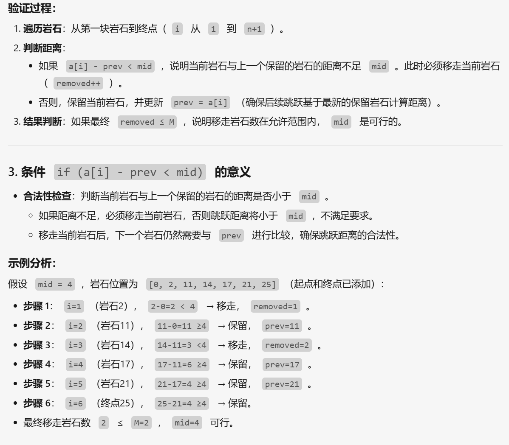

**二分的常见题面：使得选手们在比赛过程中的最短跳跃距离尽可能长。如果题目规定了有“最大值最小”或者“最小值最大”的东西，那么这个东西应该就满足二分答案的有界性（显然）和单调性（能看出来）。**

[P2678 [NOIP 2015 提高组] 跳石头 - 洛谷](https://www.luogu.com.cn/problem/P2678)
	其实这道题跟传统的二分区别倒是不大,但是需要理解枚举的东西，比如这道题就是枚举的两个岩石之间的距离,通过二分来猜，然后输出可行性的答案,下面给出ai的模拟过程 
```cpp 
	/*check()函数检查当前mid是否符合要求
	判断是否能在移走 ≤ `m` 块岩石的前提下，使得所有跳跃距离 ≥ mid*/
	bool check(int mid) {  
    int tot = 0; //可移走的石头数量  
    int i = 0; //第几块石头  
    int now = 0; //当前石头的位置  
    while (i < n + 1){  
        i++;  
        if (a[i] - a[now] < mid) //当前石头与前一个保留的岩石距离太短，移除  
            tot++;  
        else now = i;  
    }  
    return tot <= m;  
}
  /*二分部分代码*/
  signed main() {  
    ios::sync_with_stdio(false);  
    cin.tie(nullptr), cout.tie(nullptr);  
    d = read(), n = read(), m = read();  //read()为快读模版;
    for (int i = 1; i <= n; ++i) a[i] = read();  
  
    a[n + 1] = d;  
    l = 1, r = d;  
    while (l <= r){  
        mid = l + (r - l >> 1); //两岩石之间的距离  
        if (check(mid)){ //满足条件的mid，尝试更大的mid  
            ans = mid;  
            l = mid + 1;  
        } else //两石头间的距离过大，尝试更小的值  
            r = mid - 1;  
    }  
  
    cout << ans << endl;
```

![[Pasted image 20250422194740.png]]