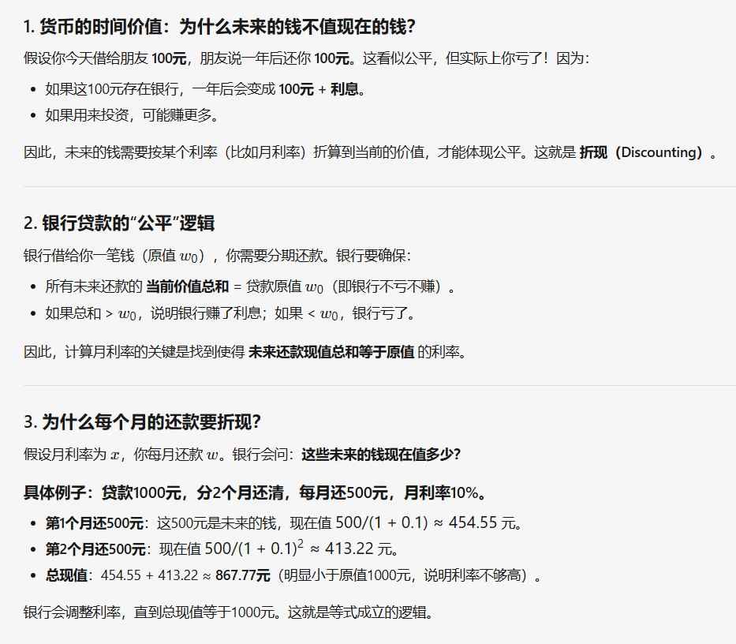
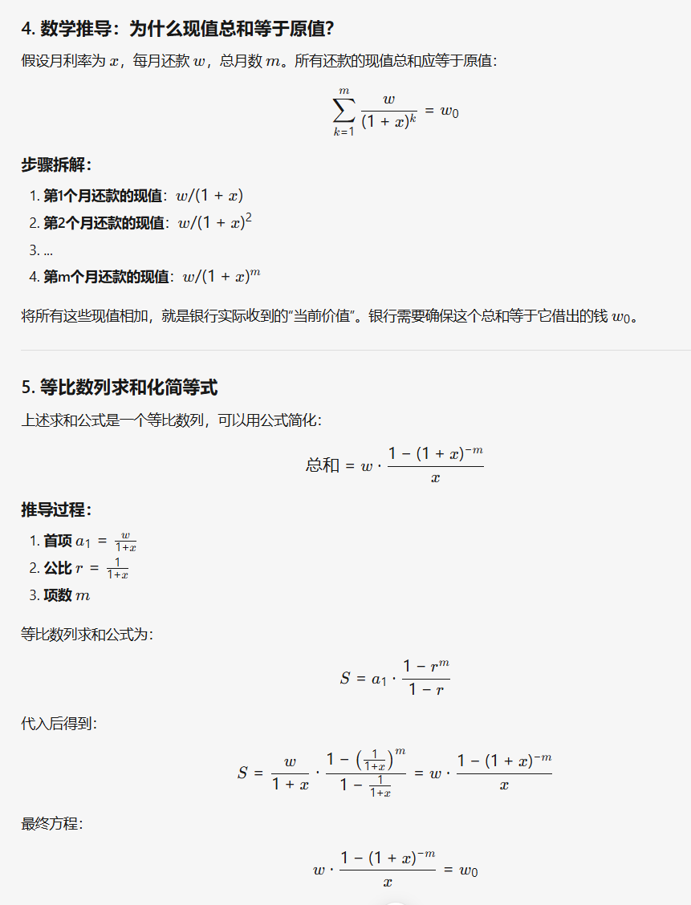
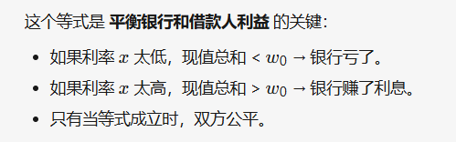

[P1163 银行贷款 - 洛谷](https://www.luogu.com.cn/problem/P1163)

这道题做起来倒不难，主要是公式推导难,因此先根据题目要求推导出所需要的公式:

这里需要知道的是，货币时间价值-->简单来说就是当前的钱在未来是不等价的，会出现贬值，因此有利息，意思就是需要保证**当前价值总和**=**贷款原值w0**，当前价值总和怎么算？就是我下面要推导的公式了：
	贴一下题目涉及的变量哈:
	贷款的原值 ==w0==，
	每月支付的分期付款金额 ==w==，
	分期付款还清贷款所需的总月数 ==m==,
	这里需要求的是月利率==x==;
	----------------------------------------------------
	怎么推导的呢:
	每个月的还款需要折现到当前的价值。例如：
	第1个月的还款 w 的现值为 $w/(1+x)$
	第2个月的还款 w 的现值为 $w/(1+x)^2​$
	...
	第m个月的还款 w 的现值为 $w/(1+x)^m​$
	求和之后得到:$$\sum_{k=1}^{m} \frac{w}{(1 + x)^k} = w_0$$
	等比公式求和化简得到第二个公式:$$ \small w \cdot \frac{1 - (1 + x)^{-m}}{x} = w_0 $$
	因此问题的关键就在于二分答案找到合适的x，下面为了方便理解，贴两张形象的解释:
		
		
	为什么要用这个公式呢?
	


经过上面的推导就可以愉快的利用公式解题了！！
```cpp

	bool check(double mid) {  
    double sum = w_i * (1 - 1 / pow(1 + mid, m)) / mid;  
    return sum >= w;  
}  
  
signed main() {  
    ios::sync_with_stdio(false);  
    cin.tie(nullptr), cout.tie(nullptr);  
    cin >> w >> w_i >> m;  
  
    double l = 0, r = 3;  
    while (r - l > 0.00001){  
        double mid = (l + r) / 2;  
        if (check(mid)){  
            ans = mid;  
            l = mid;  
        } else r = mid;  
    }  
    ans *= 100;  
    cout << fixed << setprecision(1) << ans << endl;

```

