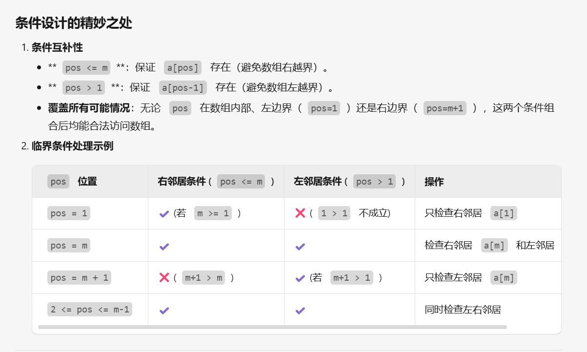

[P1678 烦恼的高考志愿 - 洛谷](https://www.luogu.com.cn/problem/P1678)

话不多说，直接先贴代码:
这道题相对于二分题单的其他题是简单的，就是处理差值这一块相对麻烦点


```cpp
int find_check(int x) {//主要作用的返回第一个大于x分数的数;
    int l = 1, r = m;  
    while (l <= r){  
        int mid = l + r >> 1;  
        if (a[mid] < x) l = mid + 1;  
        else r = mid - 1;  
    }  
    return l;  
}  
  
void solve(int x) {  
    int pos = find_check(x);  
    int minn = INT_MAX;  
    //下面两段代码是核心
    if (pos <= m) minn = min(minn, abs(a[pos] - x));  
    if (pos > 1) minn = min(minn, abs(a[pos - 1] - x));  
    sum += minn;  
}  
  
signed main() {  
    ios::sync_with_stdio(false);  
    cin.tie(nullptr), cout.tie(nullptr);  
    cin >> m >> n;  
    for (int i = 1; i <= m; i++){  
        cin >> a[i];  
        maxx = max(maxx, a[i]);  
    }  
    sort(a + 1, a + m + 1);  //二分答案是有序的，方便比对;
    while (n--){  
        int b;  
        cin >> b;  
        solve(b);  
    }  
    cout << sum << endl;

```

这两段代码是核心,下面进行详细解析:
`if (pos <= m) minn = min(minn, abs(a[pos] - x));`  
`if (pos > 1) minn = min(minn, abs(a[pos - 1] - x));`
为方便理解，贴一组样例：
输入:                     输出:
4 3                           32
513 567 598 689
500 600 550

1. **第一行代码：`if (pos <= m)`
    
    - ​**检查右侧邻居**​：`a[pos]` 是第一个 ≥`x` 的分数，可能与 `x` 的差距最小（如 `x=550`，`a[pos]=567`，差距17）。
    - ​**边界处理**​：若 `pos` 超出数组范围（如 `pos=m+1`），说明所有学校分数都 <`x`，此时无需检查右侧。
2. ​**第二行代码：`if (pos > 1)`
    
    - ​**检查左侧邻居**​：`a[pos-1]` 是最后一个 <`x` 的分数，可能与 `x` 的差距更小（如 `x=600`，学校分数为 `[598, 689]`，`a[pos]=689` 差距89，`a[pos-1]=598` 差距2）。
    - ​**边界处理**​：若 `pos=1`，说明所有学校分数都 ≥`x`，此时左侧没有元素，无需检查。


