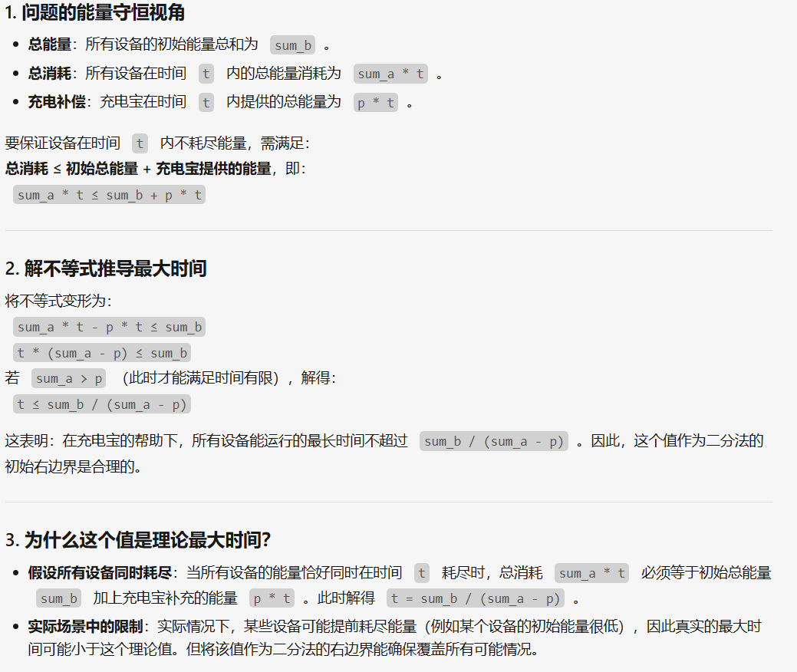
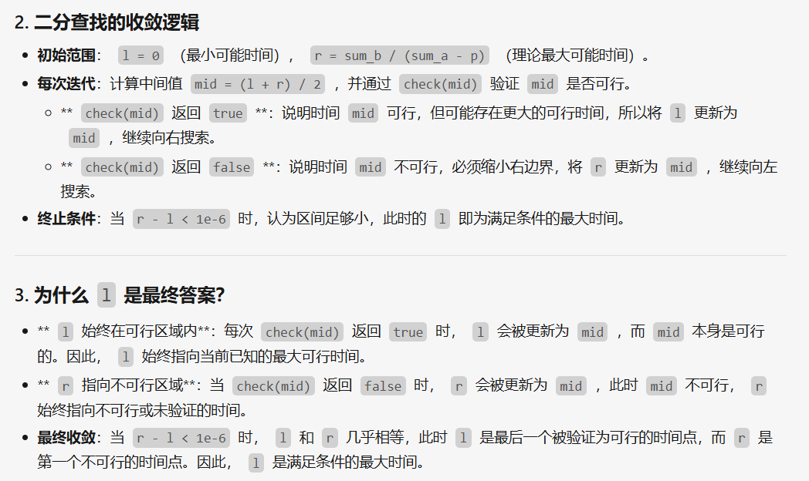
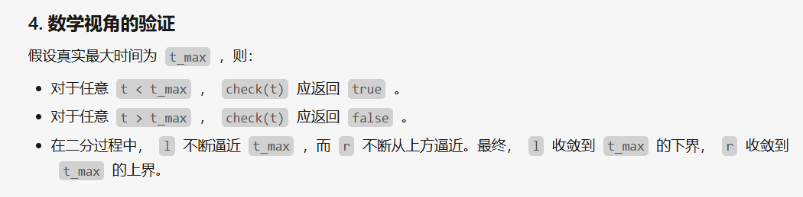

[P3743 小鸟的设备 - 洛谷](https://www.luogu.com.cn/problem/P3743)
这里把题目要点粘贴一下:
小鸟想把这些设备一起使用，直到其中有设备能量降为  $0$。所以小鸟想知道，在充电器的作用下，她最多能将这些设备==一起使用==多久。

设你的答案为 $a$，标准答案为 $b$，只有当 $a,b$ 满足
$\dfrac{|a-b|}{\max(1,b)} \leq 10^{-4}$  的时候，你能得到本测试点的满分。

需要注意的是这道题的题目明确表明是一起使用的时间而不是单独使用的时间，因此需要二分的对象就很明确->能够一起使用的时间，并且答案对精度有要求，因此变量类型尽量设置为`double`，防止`int`强制类型转换导致数据丢失

```cpp
	bool check(double t) {//传入当前可能一起使用的时间
    double sum = 0, q = t * p;//sum为超出存储补发的电量，q为在t时间内能够充值的电量
    for (int i = 1; i <= n; i++){  
        if (a[i] * t > b[i])  
            sum += a[i] * t - b[i];  
    }  
    return sum <= q;//多出的电量小于总电量，则可以尝试更大的t，l向右增大
}  
  
  
int main() {  
    ios::sync_with_stdio(false);  
    cin.tie(nullptr), cout.tie(nullptr);  
    cin >> n >> p;  
    double sum_a = 0, sum_b = 0;  
    for (int i = 1; i <= n; i++){  
        cin >> a[i] >> b[i];  
        sum_a += a[i];  
        sum_b += b[i];  
    }  
	if (sum_a <= p){ //特判，无需多言
        cout << "-1" << endl;  
        return 0;  
	}
    double l = 0, r = sum_b / (sum_a - p);  
    while (r - l > 1e-6){  //涉及精度
        double mid = (l + r) / 2;  
        if (check(mid)){  
            l = mid;  
        } else  
            r = mid;  
    }  
    cout << fixed << setprecision(10);  
    cout << l << endl;

```
下面关于`r = sum_b / (sum_a - p)`->理论最大的可能时间 进行简短的解析:
	这里注意到`sum_b`是存储的电量，`sum_a`是消耗电量的速度，p是充电的速度，`(sum_a-p)`可以理解为你消耗了一部分电量并马上得到补充，则真正消耗的那部分就是`(sum_a-p)`,以下是简短的证明过程


为什么最后输出的l就是正确答案？
	为了不使文本过于冗杂，这里直接引用ai解释:
	
	


