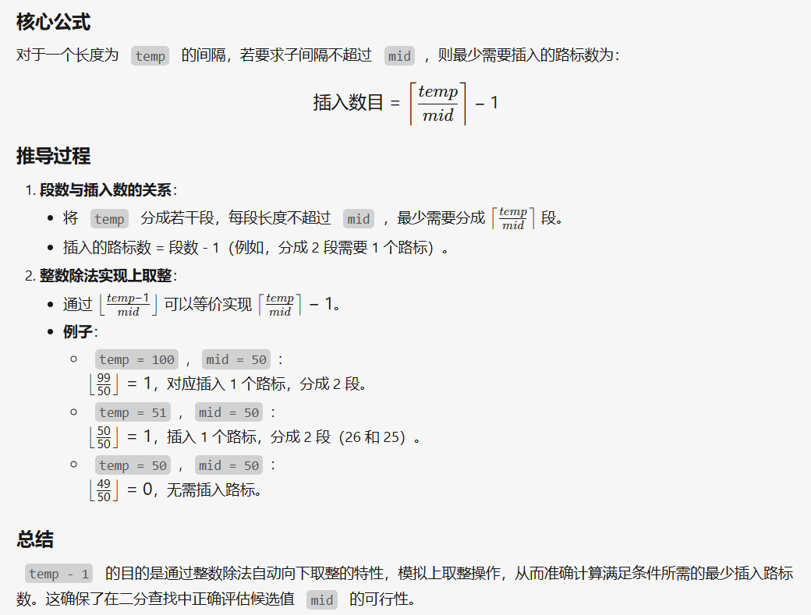

[P3853 [TJOI2007] 路标设置 - 洛谷](https://www.luogu.com.cn/problem/P3853)

其实这道题个人觉得是跟[P2678---跳石头](P2678---跳石头.md)的思想非常类似

这道题也是枚举两路标之间的数值，但是这道题是如果差值(`temp`)大于枚举的(`mid`)，则插入`(temp-1)/mid`个路标，遍历所有差值然后判断总插入的路标个数与最大可能输入的K比较，如果比k小，则答案合理去寻找下一个更小的答案，如果大于k则答案过于小了，需要增大mid的大小，下面是代码片段

```cpp 
	//比较纯粹的做法
	signed main() {  
    ios::sync_with_stdio(false);  
    cin.tie(nullptr), cout.tie(nullptr);  
    int r, n, k;  
    cin >> r >> n >> k;  
    for (int i = 1; i <= n; i++) cin >> a[i];  
  
    int ans = 0, l = 1;  
    while (l <= r){  
        int mid = l + r >> 1;  
        int sum = 0;  
        for (int i = 2; i <= n; i++){  
            int temp = a[i] - a[i - 1];  
            if (temp > mid)  
                sum += (temp - 1) / mid;  
        } //temp-1的目的是为了正确表达放置路标的数量，  
        //如temp=100,mid=50，则应该放置一个路标  
  
        //本题的目的是放置路标使空旷指数最小  
        if (sum <= k){ //当放置总数小于k，继续寻找更小的  
            ans = mid;  
            r = mid - 1; //r变小，寻找可能的更小空旷指数  
        } else l = mid + 1;  
    }  
    cout << ans;  
    return 0;  
}
	//预处理-->优化
	//上下逻辑是一样的
	signed main() {  
    ios::sync_with_stdio(false);  
    cin.tie(nullptr), cout.tie(nullptr);  
    int L, N, K, max_gap = INT_MIN;  
    cin >> L >> N >> K;  
    vector<int> arr(N);  
    for (int i = 0; i < N; ++i) cin >> arr[i];  
    vector<int> gaps;  
    for (int i = 1; i < N; ++i){  
        int gap = arr[i] - arr[i - 1];  
        gaps.push_back(gap);  
        max_gap = max(max_gap, gap); //最大的差值作为二分答案的右区间 
    }  
  
    int l = 1, r = max_gap;  
    while (l <= r){  
        int mid = l + (r - l >> 1);  
        int sum = 0;  
        for (auto g: gaps){  
            sum += (g - 1) / mid;  
        }  
        if (sum <= K){  
            r = mid - 1;  
        } else  
            l = mid + 1;  
    }  
  
    cout << l << endl;  
    return 0;  
}

```

以下是为什么要`(temp-1)/mid`的简单证明:
	为什么要`-1`个人感觉是跟数组的索引从`0-->1`的目的是相同的,都是为了实现对齐
	


下面给出这道题与[P2678---跳石头](P2678---跳石头.md)的一些相同点与区别:
	
	
	

